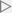

# SpritePositioner

For a recreation in Swift of the classic arcade game Robotron, I needed a way to generate random sprite
positions without overlap. This code contains an Xcode 8 Swift playground that demonstrates the solution I came
up with.

The class Positioner generates positions based on settings provided in the constructor (see
`PositionerPlayground.playground/Sources`). The gist is that we divide up the given rectangle into possible
locations, then randomly vary the positions in X, Y dimensions that will keep the necessary separation so that
no two sprite positions will overlap. Finally, we dole out positions in a random way. See the source for
additional info.

## Operation

If the playground does not start running, click on the  button at the bottom of the Xcode
window to start it. After a short pause you should see a scene like that shown above to the right of the code.
If *that* does not appear, make sure the assistant editor is visible on the right.

The sprites in the scene start out with an alpha of 1.0 (opaque) and then gradually fall to an alpha of 0.10 in
order to give some semblance of the randomness in which the values come from the `Positioner`. The red region
behind the **Regen** button shows a *void* where sprites will not appear. The size and position of this region
is set in the [Contents.swift](./PositionerPlayground.playground/Contents.swift) as `void`, but the actual
filtering is done in the [Button.swift](./PositionerPlayground.playground/Sources/Button.swift) file in the
`regenPositions` routine.

Clicking on the **Regen** button will regenerate a new set of positions.

## Files

Everything is located in the [PositionerPlayground.playground](./PositionerPlayground.playground) directory.
The Swift source for the playground is
there as [Contents.swift](./PositionerPlayground.playground/Contents.swift). The supporting files are found in
the [Sources](./PositionerPlayground.playground/Sources) folder:

* [Positioner.swift](./PositionerPlayground.playground/Sources/Positioner.swift) -- the position generating code
* [Button.swift](./PositionerPlayground.playground/Sources/Button.swift) -- creates the *Regen* button shown above the scene. The `regenPositions` method populates the
SpriteKit scene of the playground with sprites using data from the `Positioner` instance.
* [RandomUniform.swift](./PositionerPlayground.playground/Sources/RandomUniform.swift) -- random number generator using the facilities from Apple's
[GameKit](https://developer.apple.com/reference/gamekit)
* [CoreGraphics+Additions.swift](./PositionerPlayground.playground/Sources/CoreGraphics+Additions.swift) -- extentions to various
[CoreGraphics](https://developer.apple.com/reference/coregraphics) structs to allow for simple math expressions
