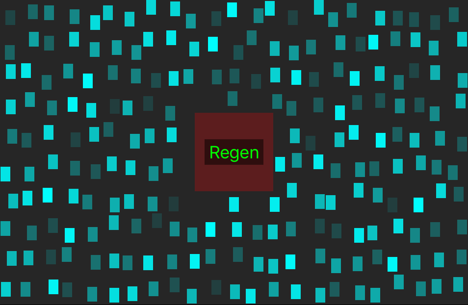

# SpritePositioner

For a recreation of Robotron in Swift, I needed a way to generate random sprite positions without overlap. This is an Xcode 8 Swift playground that demonstrates the solution I came up with.

The class Positioner generates positions based on settings provided in the constructor (see
`PositionerPlayground.playground/Sources`). The gist is that we divide up the given rectangle into possible
locations, then randomly vary the positions in X, Y dimensions that will keep the necessary separation so that
no two sprite positions will overlap. Finally, we dole out positions in a random way. For the gory details,
please see the source.

## Operation

If the playground does not start running, click on the '|>' button at the bottom of the Xcode window to start
it. After a short pause you should see a scene like that shown above to the right of the code. If *that* does
not appear, make sure the assistant editor is visible on the right.

## Files

Everything is located in the `PositionerPlayground.playground` directory. The Swift source for the playground is
there as `Contents.swift`. The supporting files are found in `Sources`:

* `Positioner.swift` -- the position generating code
* `CoreGraphics+Additions.swift` -- extentions to various
[CoreGraphics](https://developer.apple.com/reference/coregraphics) structs to allow for simple math expressions
* `RandomUniform.swift` -- random number generator using the facilities from Apple's
[GameKit](https://developer.apple.com/reference/gamekit)
